# Workshop: Introduction to Git and GitHub for Beginners 

Welcome to the Intro to Git and GitHub workshop! Read through this guide and perform the hands-on activities to complete the workshop. Git is a type of version control system that allows you to keep a history of your work so you can experiment safely, recover from mistakes, and collaborate without overwriting changes from other team members.

> **Note**: The two popular methods for working with Git are the command line interface (CLI) tools and the graphical user interface (GUI). The GUI is easier to understand and use, especially for newcomers and simple projects. The CLI tool has a steeper learning curve but is generally more powerful. I'll put both in this guide, and you can choose whichever one you like better.

## Table of Contents

- [Overview](#overview)
  - [What is Version Control?](#what-is-version-control)
  - [What is Git?](#what-is-git)
  - [What is GitHub?](#what-is-github)
  - [Terminology](#terminology)
- [Hands-on Exercise 1: Basic Flow](#hands-on-exercise-1-basic-flow)
  - [Create a GitHub Account](#create-a-github-account)
  - [Create Repository](#create-repository)
  - [CLI vs. GUI](#cli-vs-gui)
  - [Option 1: Command Line Tools (CLI)](#option-1-command-line-tools-cli)
  - [Option 2: GitHub Desktop (GUI)](#option-2-github-desktop-gui)
- [Challenge 1: Create a README](#challenge-1-create-a-readme)
- [Challenge 2: Tag a Commit](#challenge-2-tag-a-commit)
- [Challenge 3: Share Your Project](#challenge-3-share-your-project)
- [Hands-on Exercise 2: Revert a Change](#hands-on-exercise-2-revert-a-change)
  - [Option 1: Command Line Tools (CLI)](#option-1-command-line-tools-cli-1)
  - [Option 2: GitHub Desktop (GUI)](#option-2-github-desktop-gui-1)
- [Hands-on Exercise 3: Branching and Merging](#hands-on-exercise-3-branching-and-merging)
  - [Option 1: Command Line Tools (CLI)](#option-1-command-line-tools-cli-2)
  - [Option 2: GitHub Desktop (GUI)](#option-2-github-desktop-gui-2)
- [Challenge 4: Pull Request](#challenge-4-pull-request)
- [Going Further](#going-further)
- [License](#license)

## Overview

### What is Version Control?

Version control is a system for tracking changes to files over time so you can see what changed, when it changed, and restore earlier versions if needed. Instead of keeping multiple copies of files with names like *my_project.py*, *my_project_v2.py*, and *my_project_final_FINAL.py*, a version control system maintains an organized history of a project. This makes it easier to experiment safely, recover from mistakes, and collaborate with others without overwriting each other’s work. Version control is especially useful in programming, where even small changes can introduce bugs and teams often need to work on the same codebase at the same time.

### What is Git?

Git is a version control system that runs locally on your computer and records snapshots of your project called commits. Each commit represents the state of your files at a particular moment in time, allowing you to review changes or return to earlier versions. What makes Git unique among version control systems is that it is distributed, meaning every copy of a repository contains the full project history rather than relying on a single central server. This makes Git fast, flexible, and reliable, and allows developers to work offline and experiment safely using features like branches. Services like GitHub build on Git by providing online storage and collaboration tools for Git repositories.

> *Did you know?* Git was originally created by Linus Torvalds (the creator of Linux) in 2005 after the free license of BitKeeper (the version control software being used for Linux development) was revoked. Torvolds then set out to make something better. Feel free to read the full history [here](https://en.wikipedia.org/wiki/Git#History).

While Git was originally designed to help programming teams keep track of changes and merge files from multiple developers, it works with any type of file. While you might not get the nice features of e.g. seeing exactly what line changed for each commit, there's nothing stopping you from committing your CAD design files. In fact, you should consider using a version control system for all your projects. If you use a cloud-based version control system (e.g. GitHub), you are backing up your work in case something happens to your local copy (such as your laptop catching on fire).

### What is GitHub?

GitHub is an online platform that hosts Git repositories and makes it easier to share code and collaborate with others. While Git itself runs locally on your computer and tracks the history of your project, GitHub stores a copy of that project on the internet so you can back it up, access it from multiple computers, and work with other people. GitHub also adds collaboration features on top of Git, such as pull requests, code reviews, issue tracking, and project documentation. In simple terms, Git is the tool that tracks changes, and GitHub is a service that stores Git repositories online and helps people work together on them.

> **Note**: GitHub isn't the only place to host Git repositories (another option is [Bitbucket](https://bitbucket.org)), but it's the most popular, which makes it the easiest place to start.

### Terminology

Git has some common phrases that can be a little confusing if it's your first time. Feel free to 
come back to this glossary if you need to look up a definition.

 * **Branch** - A separate line of development that lets you work on changes without affecting the main project.
 * **Clone** - Downloading a complete copy of a repository from the internet to your computer.
 * **Commit** (`git commit`) -  A saved snapshot of your project at a specific point in time. Each commit records changes and includes a message describing what was done. Think: save with history.
 * **Commit Message** - A short description of what changed in a commit.
 * **Git** - A version control system that runs locally on your computer and tracks the history of a project using snapshots called commits.
 * **Fork** - Your own copy of someone else’s repository on GitHub that you can modify independently and use to propose changes back to the original project.
 * **GitHub** - A website that hosts Git repositories online so you can back up your work and collaborate with others.
 * **Head** - The pointer that refers to the current commit (and usually the current branch) you are working on in a Git repository.
 * **Local Repository** - The copy of the repository stored on your computer where you edit files and make commits.
 * **Main Branch (main)** - The primary or stable version of the project.
 * **Merge** - Combining changes from one branch into another.
 * **Origin** - The default name Git gives to the remote repository on a server (such as GitHub) that your local repository connects to for pushing and pulling changes.
 * **Pull** (`git pull`) - Downloading changes from the remote repository to your computer.
 * **Pull Request (PR)** - A request on GitHub to merge changes from one branch into another. Pull requests allow changes to be reviewed before merging.
 * **Push** (`git push`) - Uploading commits from your computer to the remote repository.
 * **Remote Repository** - The copy of the repository stored online (for example on GitHub).
 * **Repository (Repo)** - A project folder that Git tracks, including the files and their full change history. Think: project folder + history.
 * **Staging** (`git add`) - Selecting which changes will be included in the next commit.
 * **Tag** - a named label that marks a specific commit in a repository’s history, often used to identify important versions like releases (e.g. v1.0).
 * **Upstream** - The original repository that a forked repository is based on, and it is often added as a remote so you can pull updates from the original project into your fork.
 * **Version Control** - A system for tracking changes to files over time so you can review changes and restore earlier versions if needed.
 * **Working Directory** - The files on your computer that you are currently editing.

## Hands-on Exercise 1: Basic Flow

In this hands-on exercise, we'll demonstrate how to initialize a repository, commit a few files, and push them to GitHub.

### Create a GitHub Account

Navigate to [github.com](https://github.com/) and create an account. 

### Create Repository

While you can create a folder on your computer then turn it into a repository, I personally find it much easier to create the repository on GitHub first then download ("clone") it onto your computer.

Navigate to [github.com](https://github.com/), sign in (if you have not done so already), click the '+' button in the top-right, and select **New repository**.

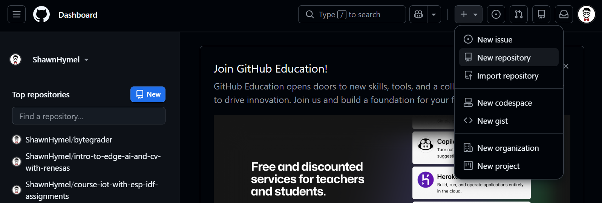

Give your repository a descriptive (or silly) name, like `my-first-repo`. Leave everything else at their defaults.

> **Note**: Any time you see `my-first-repo` in the tutorial below, swap that out for whatever name you gave your repository.

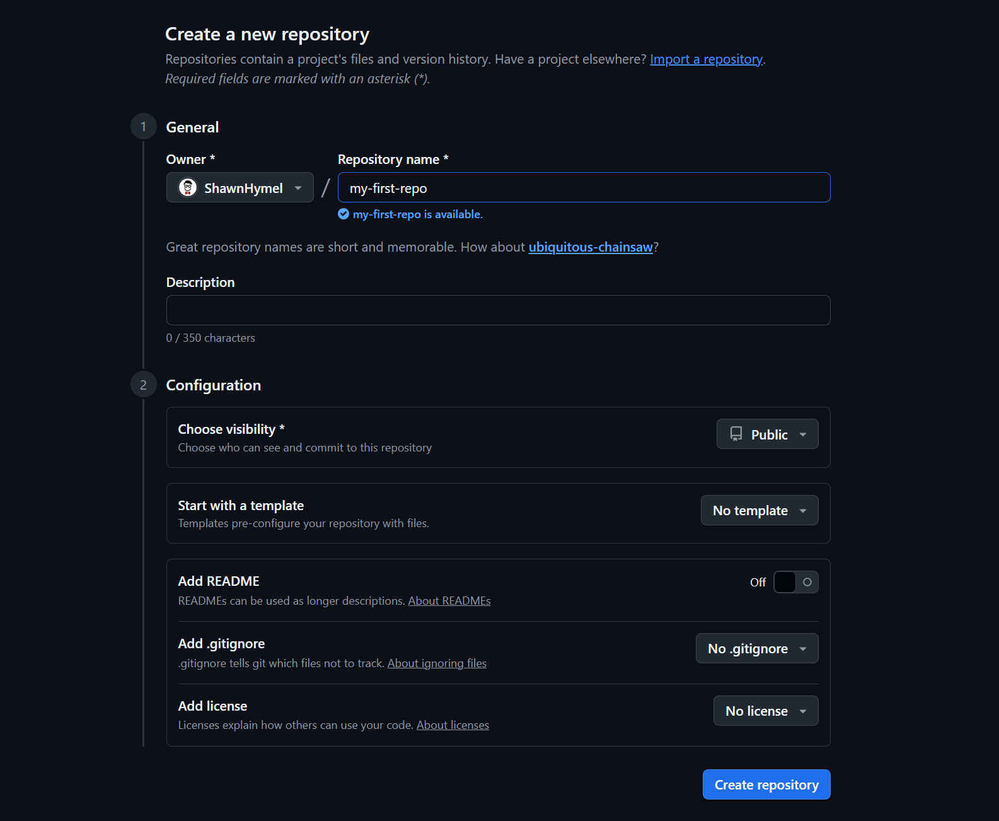

### CLI vs. GUI

You have two options for working with Git in this tutorial: CLI and GUI. I recommend learning how to use the CLI, as it's the most powerful and can work on nearly any system. However, the GUI is much simpler to understand and use.

Choose one of the paths (CLI or GUI) below and stick with it for the workshop. Feel free to try the other path later if you have time.

### Option 1: Command Line Tools (CLI)

#### Install required software

The `git` command line tool was originally developed for Linux. As a result, it's not fully natively supported on Windows and macOS. However, there are a number of ways to get it to work on these operating systems.

Navigate to the page listed for your OS and follow the instructions to install the `git` command line tool:

 * Windows: [git-scm.com/install/windows](https://git-scm.com/install/windows)
   * Choose the *Standalone Installer* for your x64 or ARM64 computer
   * **Important!** The Windows version installs a separate command line program called *Git Bash*. Every time you want to use `git` on the command line, you must first run the *Git Bash* program (search for it and/or put it on your taskbar).
 * macOS: [git-scm.com/install/mac](https://git-scm.com/install/mac)
 * Linux: [git-scm.com/install/linux](https://git-scm.com/install/linux)

#### Clone Empty Repository

Now, we will download ("clone") a repository from GitHub to our local computer. On your command line (run *Git Bash* if you are on Windows), create a place to keep your repositories. Note that you can put your repositories anywhere on your computer (as they are essentially just folders), but I like to keep them in a single spot.

```sh
mkdir -p ~/Documents/GitHub
cd ~/Documents/GitHub/
```

Clone the repository you just created. This will download the "empty" repository from GitHub onto your computer. Note that while the repository is "empty" (no user created files), there will still be a hidden `.git/` folder that denotes this folder as a repository.

> **Important!** Change the `<YOUR_USERNAME>` to your GitHub username.

After that downloads, navigate into the repository's directory. Feel free to look at the files in there (should just be the `.git/` folder).

```sh
git clone https://github.com/<YOUR_USERNAME>/my-first-repo
cd my-first-repo/
ls -la
```

<p align="center">
    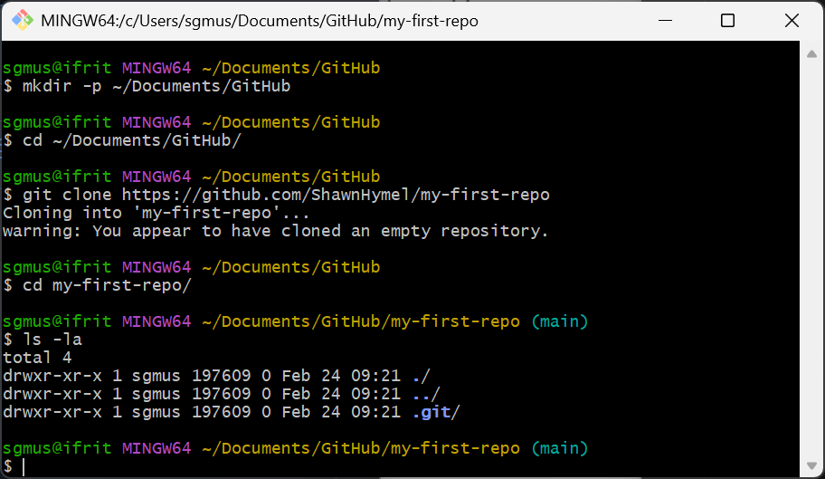
</p>

#### Write Some Code

In your local repository folder, create a new folder:

```sh
mkdir source/
```

Use your favorite editor to create a source code file in that folder. For example:

```sh
nano source/hello.py
```

Add some code to that file, such as:

```python
print("Hello, world!")
```

If you have Python installed on your computer, you can run it with:

```sh
python source/hello.py
```

#### Commit and Push Changes

Now that you've added some code, let's commit these changes. Note that at any time, you can enter the following (as long as you're somewhere in the repository folder) to get an idea of what's being staged or committed:

```sh
git status
```

Stage all new folders/files with:

```sh
git add -all
```

Commit the changes and add a brief description of the changes you made:

```sh
git commit -m "Created a hello world script"
```

Push the changes to your "remote" GitHub repository:

```sh
git push
```

> **Note**: Git Bash may as you to sign into your GitHub account in order to push changes. On the pop-up, click **Sign in with browser** and follow the on-screen instructions to authorize Git Bash.

In a browser, navigate to your repository on GitHub: `github.com/<YOUR_USERNAME>/my-first-repo`. You should see your new *source/* folder in the repository. Click on it, and click on *hello.py* to see the code you wrote!

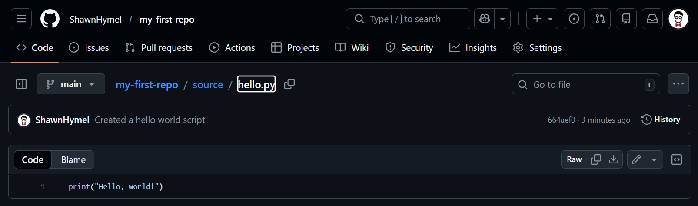

### Option 2: GitHub Desktop (GUI)

#### Install required software

Navigate to [github.com/apps/desktop](https://github.com/apps/desktop), click the **Download now** button, and download GitHub Desktop for your operating system.

Run the installer and follow all the on-screen instructions to sign in to your account. This will navigate you to a page that has you authorize GitHub Desktop on your GitHub account.

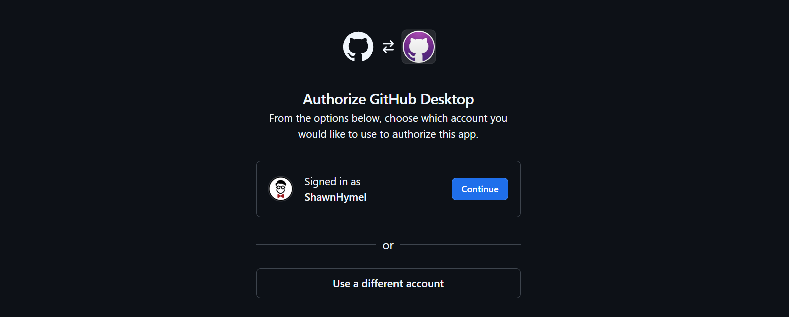

Click **Continue** to move to the next screen.

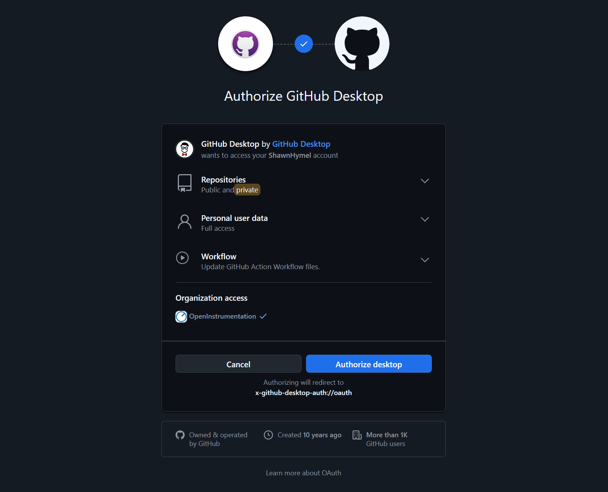

Click **Authorize desktop** to connect your account to GitHub Desktop. Note that you might be asked to provide your password.

GitHub Desktop will then ask you to provide your name and email. Use the default GitHub credentials here (the *no reply email* is useful so that people can't find you).

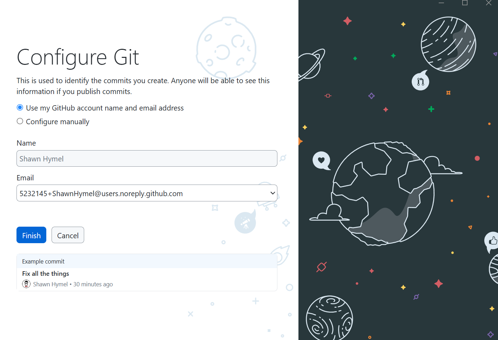

#### Clone Empty Repository

In the top bar, click the refresh button to the right of the search bar to sync the listed repositories with those on GitHub. Search for "my-first-repo." Click to select the "my-first-repo" repository.

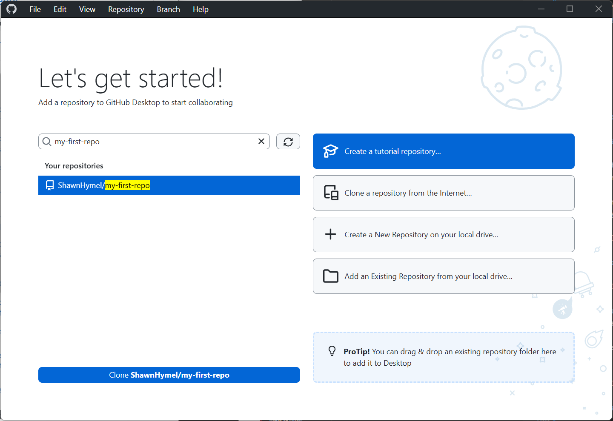

Click **Clone <YOUR_USERNAME>/repository**.

You will then be asked where you want to store your repository on your local computer. Note that you can put your repositories anywhere on your computer (as they are essentially just folders), but I like to keep them in a single spot.

Change the *Local path* to somewhere where you wish to keep your repository.

<p align="center">
    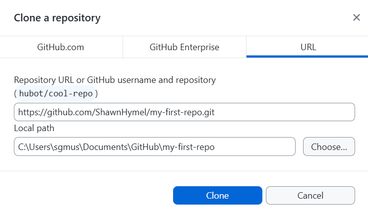
</p>

Click **Clone**. You will be presented with the GitHub Desktop interface where you can track your changes, commit new changes, roll back changes, etc.

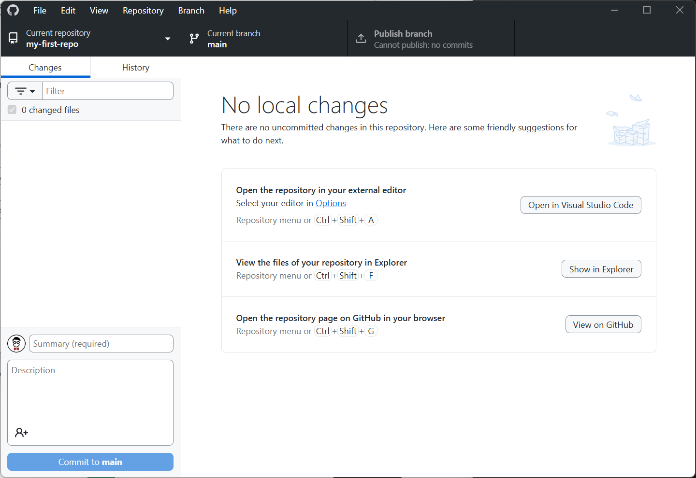

#### Write Some Code

Use your file explorer or favorite editor to create a new *source/* folder in the local repository folder. In *source/* create a file named *hello.py* and enter the following code:

```python
print("Hello, world!")
```

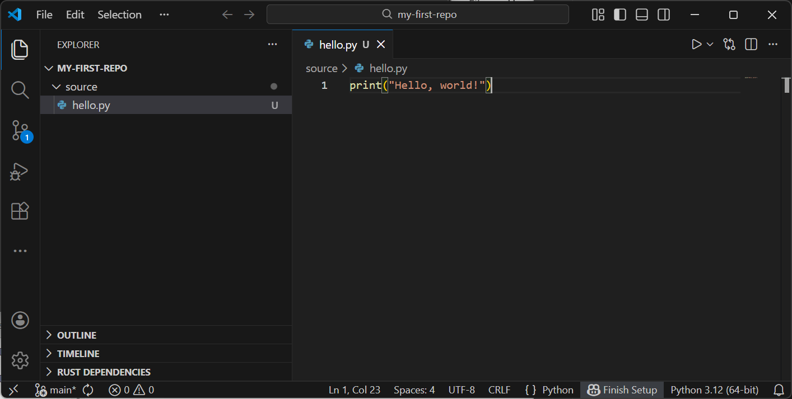

Save the file. If you have Python installed on your computer, you can run it with:

```sh
python source/hello.py
```

#### Commit and Push Changes

In *GitHub Desktop*, you should see the new *source/hello.py* file that has been created. You can see that it is staged to be committed by the checkmark next to the file in the left pane (in the *Changes* tab).

On the right side, you can see the changes made to your files. A `+` at the beginning of the line indicates text that was added. A `-` indicates text that was removed.

In the bottom part of the left pane, add a brief description (and optional longer description) explaining the changes you made.


Click **Commit 1 file to main**. You have now created a local snapshot of your repository.

To push these changes to GitHub, press the **Push origin** button.

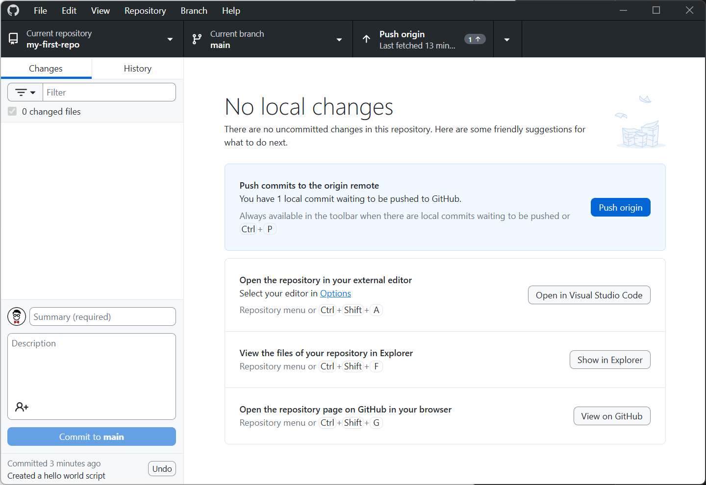

In a browser, navigate to your repository on GitHub: `github.com/<YOUR_USERNAME>/my-first-repo`. You should see your new *source/* folder in the repository. Click on it, and click on *hello.py* to see the code you wrote!


## Challenge 1: Create a README

GitHub will automatically render and display markdown in a file named `README.md` in any folder of your repository. These readme files are a great place to describe your project, give it a status, tell people how to install it, and how to use it.

Create a file named `README.md` in the root directory of your repository (the `my-first-repo/` folder). Give your repository a title and brief description. For example, in some editor of your choice, add this to the file:

```md
# My First Repository

I'm following the instructions from Shawn's [GitHub workshop](https://github.com/ShawnHymel/workshop-intro-to-git-and-github)!
```

See [here](https://docs.github.com/en/get-started/writing-on-github/getting-started-with-writing-and-formatting-on-github/basic-writing-and-formatting-syntax) for more information on formatting markdown.

Your challenge is to commit and push this file to your repository. If done correctly, the main page of your repository should be populated with some good info about your project.

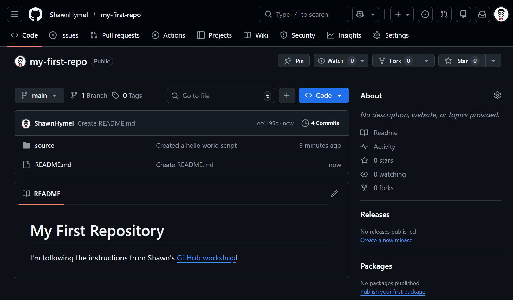

## Challenge 2: Tag a Commit

Tags are used to mark important points in a repository's history, such as releases or milestones. A *tag* is a named label that refers to a specific commit.

In this challenge, you will create a tag for a commit in your repository and push the tag to GitHub.

Your challenge is to tag your current commit with `v1.0` and push it to your remote (GitHub) repository.

Hints:
 * If you are using the CLI tool, see [this page](https://git-scm.com/book/en/v2/Git-Basics-Tagging) for help.
 * If you are using the GUI tool, see [this page](https://docs.github.com/en/desktop/managing-commits/managing-tags-in-github-desktop) for help.

When you're done, you should be able to go to your repository on GitHub and click on the **Tag** button to view your new tag.

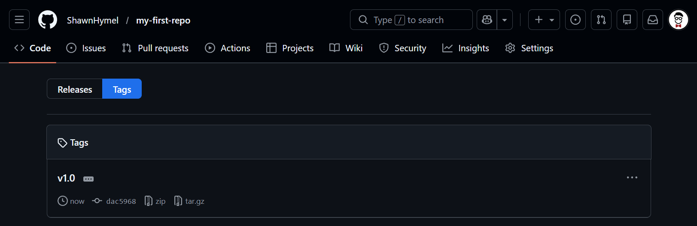

## Challenge 3: Share Your Project

Prove the URL of your repository to someone else. Have them look through your files and code. Note that they can even download all the files without needing to clone the project! Simply click **Code** then click **Download ZIP** on the main page of the repository.

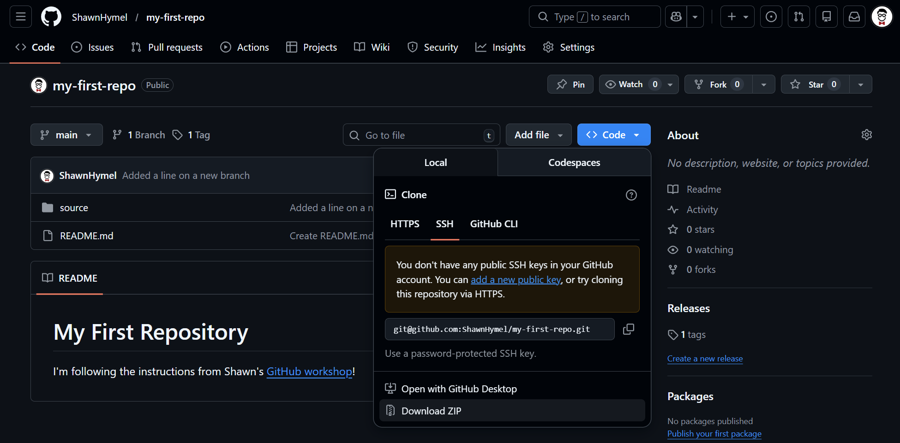

## Hands-on Exercise 2: Revert a Change

Purposely introduce some error into your Python code. For example, maybe change it to something like:

```python
print("Hello, world!")
asdfasdf
```

Commit and push this new change (using either the CLI or GUI). This will simulate checking in a version with some mistake.

Now, let's "undo" the changes of that commit.

> **Important!** "Reverting" undoes the changes in a particular commit and then creates a new commit with those changes. This is the safest way to undo changes in a Git repository, as the history is kept intact. If you *really* want to mess with the timeline (i.e. completely remove one or more commits), you can use [git reset](https://git-scm.com/docs/git-reset). This is considered the "nuclear option" and should be used with extreme caution, as changes are deleted forever.

### Option 1: Command Line Tools (CLI)

Use `git log` to see a history of your recent commits. The most recent commit will be at the top. Highlight and copy the commit hash (if you are on Windows, press `shift+ctrl+c` or right-click and select *Copy*).

<p align="center">
    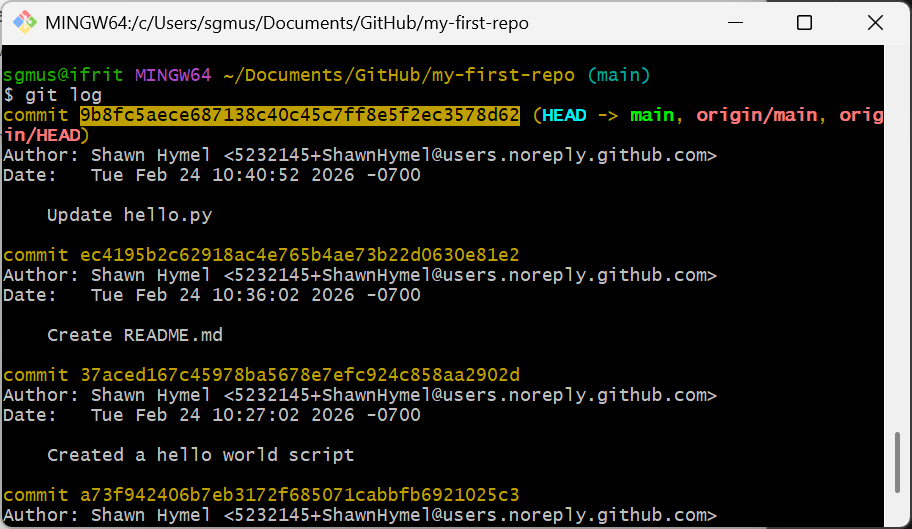
</p>

Press `q` to exit out of the *log* viewer.

Use `git revert <HASH>` to undo the changes in the previous commit. Paste in the hash you copied for `<HASH>`

> **Note**: `revert` simply undoes the changes made in a specific commit (which you identify with the hash). In most cases, you'll want to undo the changes in the most recent commit. To avoid having to find the hash, you can simply use `git revert HEAD` to undo the last commit.

You'll be asked to provide a description about why you are reverting the commit. Feel free to change the default text provided or just leave it.

> **Note**: If you are using *Git Bash* on Windows, you'll likely have `vim` as the default editor. You'll start in *insert* mode (give by `-- INSERT --` at the bottom). Feel free to type normally in this mode. Press `esc` to leave *insert* mode and go into *command* mode. In this mode, type `:wq` (you can see your entered command at the bottom) and press `enter` to "write and quit" (save and exit). 

You can now see your changes with `git status` and `git log`. Use `git push` to commit the reverted changes to GitHub. Feel free to check your *source/hello.py* file to make sure the changes were reverted.

#### Option 2: GitHub Desktop (GUI)

Click on the **History** tab in the left pane to see a log of all your commits. Right-click on your latest commit (the one at the top) and select **Revert changes in commit**.

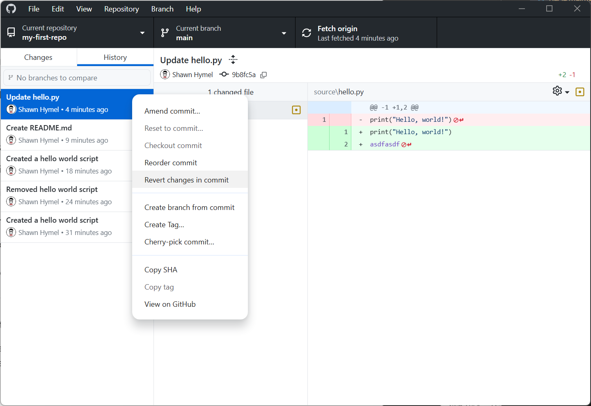

This creates a new commit that undoes the changes in the previous commit. You'll see a note by this new commit (up arrow icon) saying that you have not pushed your changes.

Click on the **Changes** tab and click **Push origin** to push the latest commit to GitHub. Feel free to check the repository on GitHub to ensure that *source/hello.py* was reverted correctly (and no longer contains the error we introduced).

## Hands-on Exercise 3: Branching and Merging

So far, we've made changes directly on the **main branch**, which is the primary version of the project. However, this is not always the best way to work. If you want to try a new feature or experiment with changes, it's safer to work on a **branch**.

A **branch** is a separate line of development that lets you work on changes without affecting the main project. When you're satisfied with your changes, you can **merge** the branch back into the main branch. This lets you experiment safely without breaking the main version of the project.

> **Important!** Branching is one of Git's most powerful features. It allows multiple people (or even just you) to work on different changes at the same time (i.e. each in their own branch).

The typical workflow looks like this:

```
main -------------------------------------------------------+--- new commit in main
   |                                                        |
   +--- new branch > make changes > merge back into main ---+
```

### Option 1: Command Line Tools (CLI)

#### Create a New Branch

Make sure you are in your repository directory. Check which branch you are currently on:

```sh
git branch
```

You should see:

```sh
* main
```

The * indicates the current branch.

Create and switch to a new branch:

```sh
git checkout -b new-feature
```

Verify that you switched branches:

```sh
* new-feature
  main
```

This means you are working on the *new-feature* branch instead of *main*.

#### Make Changes on the Branch

Edit your *source/hello.py* file and add another line:

```python
print("Hello, world!")
print("This line was added on a branch.")
```

Save the file. Check your changes:

```sh
git status
```

#### Commit and Push the Branch

Stage and commit your changes:

```sh
git add --all
git commit -m "Added a line on a new branch"
```

Push the branch to GitHub:

```sh
git push -u origin new-feature
```

> **Note**: The -u option tells Git to remember which remote branch to use in the future. After this, you can simply use `git push` for future commits on this branch.

Navigate to your repository on GitHub. You should see a message suggesting that you create a *Pull Request* for your new branch. Do not push the button, as we'll cover pull requests in the next section.

Click on **main**, which should drop down a menu. Under *Branches*, you can click to switch over to your *new-feature* branch. Feel free to see the changes (in *source/hello.py*) between the *main* and *new-feature* branches.

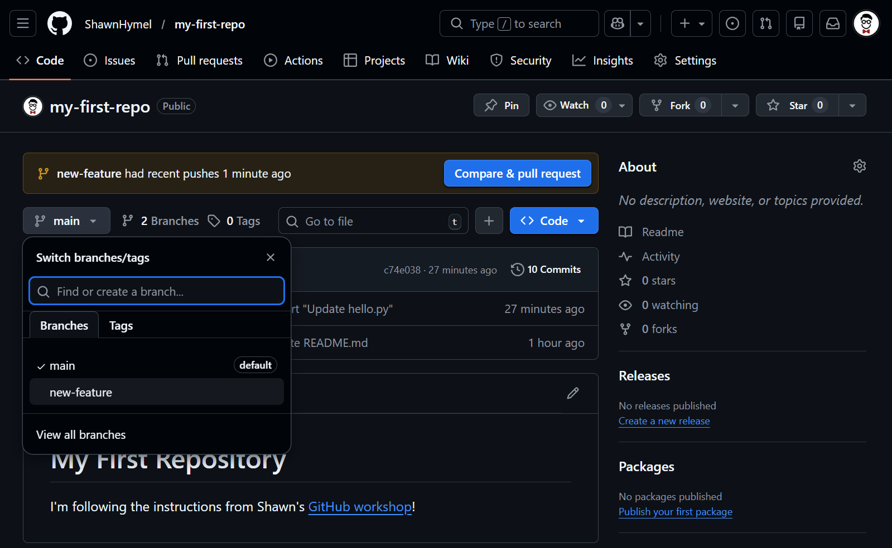

#### Merge the Branch into Main

Switch back to the main branch:

```sh
git checkout main
```

Download any updates from your remote (GitHub) repository:

```sh
git pull
```

Merge the branch into main:

```sh
git merge new-feature
```

Push the updated main branch to GitHub:

```sh
git push
```

Your changes from the *new-feature* branch are now part of the main project. Feel free to verify these changes on GitHub (note that you might need to refresh the page to see the update).

#### Delete Branch

After merging a branch, you can delete it in the CLI with:

```sh
git branch -d new-feature
```

Note that this does not delete the branch from GitHub! If you also pushed the branch to GitHub, you can delete it there too:

```sh
git push origin --delete new-feature
```

Feel free to navigate to your GitHub repository (refresh if needed) and verify that the branch is no longer there.

### Option 2: GitHub Desktop (GUI)

#### Create a New Branch

In GitHub Desktop, click the **Current branch** button near the top of the window. 

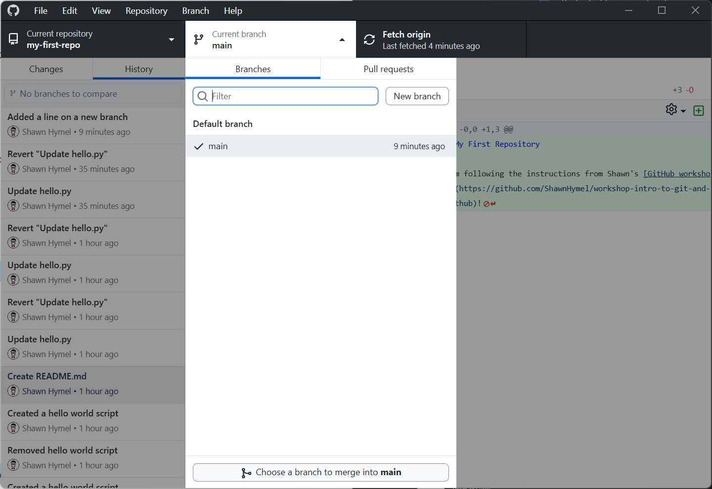

Click **New branch**. Give your new branch a name (e.g. "new-feature").

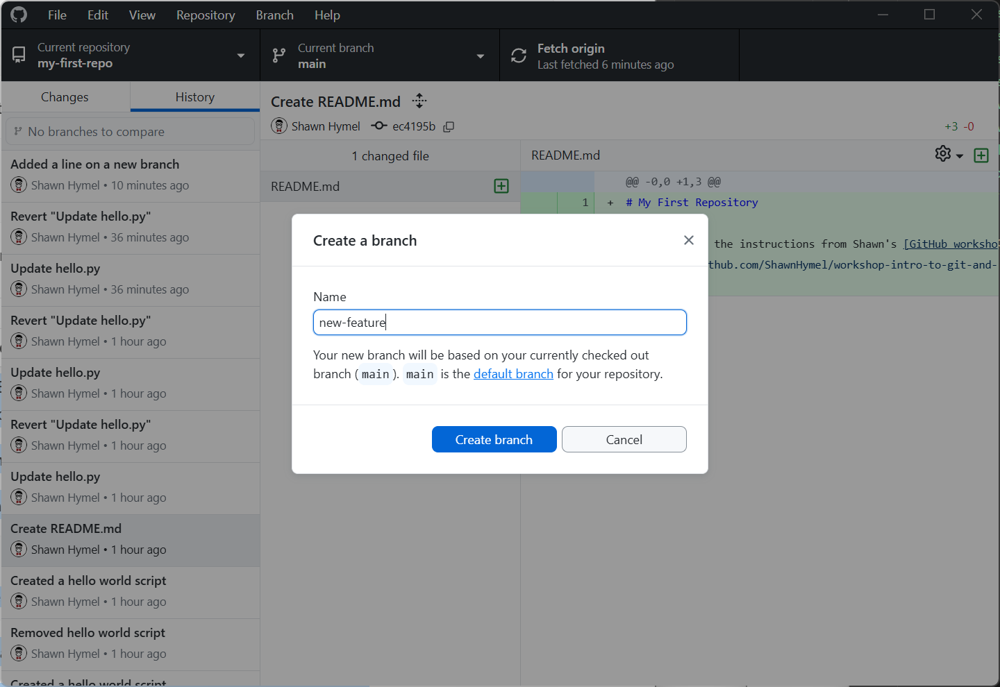

Click **Create branch**.

GitHub Desktop will switch you to the new branch automatically. You should now see *new-feature* listed as the current branch.

#### Make Changes on the Branch

Edit your *source/hello.py* file and add another line:

```python
print("Hello, world!")
print("This line was added on a branch.")
```

Save the file. Your changes should be reflected in on the right panel of GitHub Desktop.

#### Commit and Push the Branch

Enter a commit message:

```
Added a line on a new branch
```

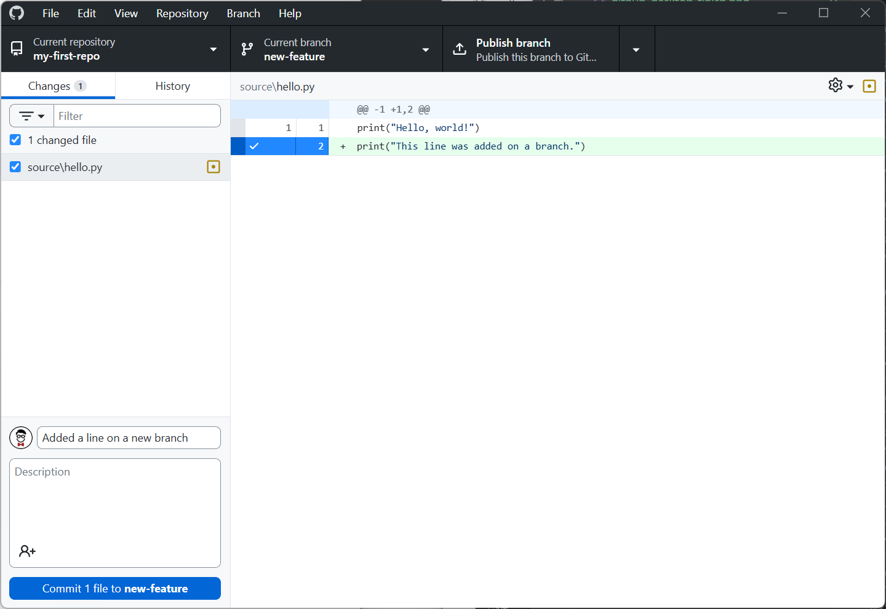

Click the **Commit 1 file to new-feature** button.

Then click **Publish branch** to upload the branch to GitHub.

Navigate to your repository on GitHub. You should see a message suggesting that you create a *Pull Request* for your new branch. Do not push the button, as we'll cover pull requests in the next section.

Click on **main**, which should drop down a menu. Under *Branches*, you can click to switch over to your *new-feature* branch. Feel free to see the changes (in *source/hello.py*) between the *main* and *new-feature* branches.


#### Merge the Branch into Main

Click the **Current branch** button. Click **main** to check out the *main* branch.

GitHub Desktop will switch back to the main branch.

Click the **Current branch** button again. You should see a check mark next to your current branch (should be *main*). Click the **Choose a branch to merge into main** button.

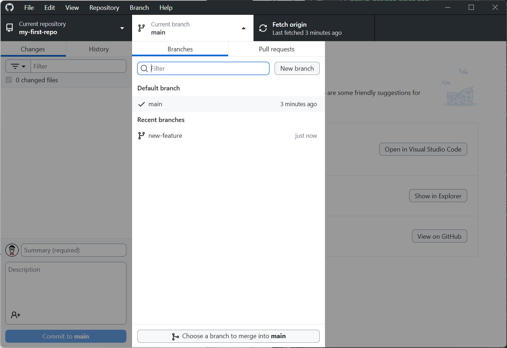

On the next screen, select the **new-feature** branch.

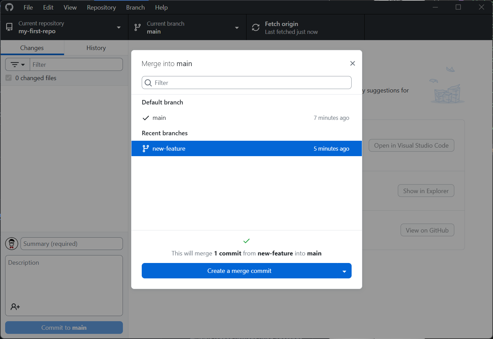

Click **Create a merge commit**. Your *new-feature* branch has now been merged into *main*.

Back on the main screen, click **Push origin**. 

Your changes from the *new-feature* branch are now part of the main project. Feel free to verify these changes on GitHub (note that you might need to refresh the page to see the update).

#### Delete Branch

After merging a branch, you can delete it using GitHub Desktop. Click the **Current branch** button. Right-click on **new-feature** and select **Delete**.

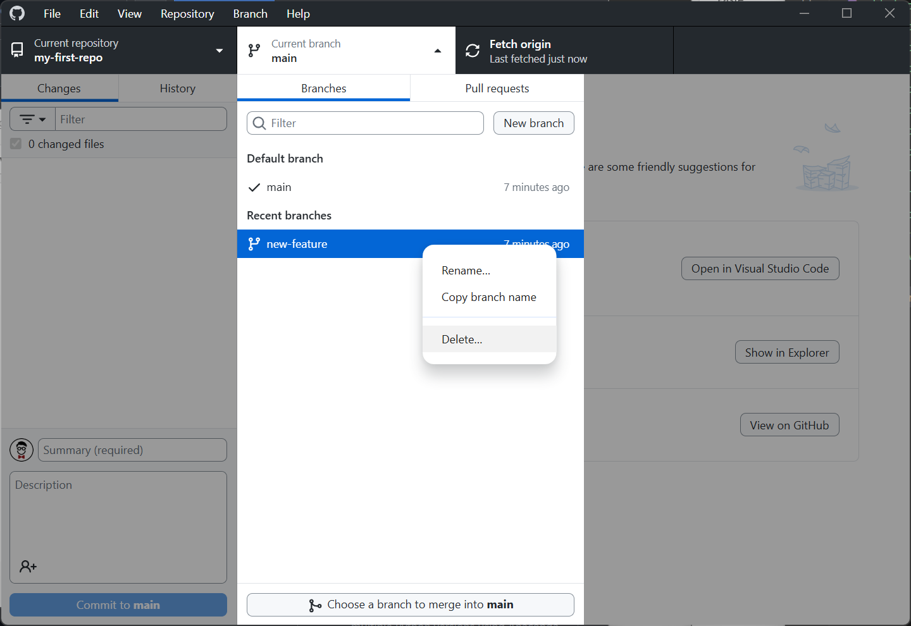

You'll be asked to verify your choice to delete the branch. If you wish to also delete the branch from the remote server (GitHub), you can select *Yes, delete this branch on the remote*.

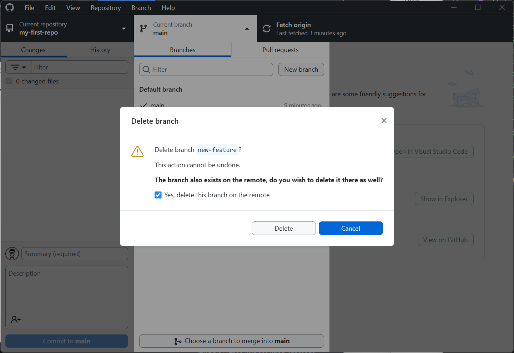

Click **Delete**.

Feel free to navigate to your GitHub repository (refresh if needed) and verify that the branch is no longer there.

## Challenge 4: Pull Request

The Pull Request (PR) is a key feature of Git, but it's also one of the most confusing. With a PR, you are asking to make changes to *someone else's* repository, and they can either accept or reject your request. This opens up a ton of possibilities for collaboration while still allowing the repo's maintainer(s) to verify any changes before they happen.

I'll give you an overview of the steps you need to perform but not the exact commands or buttons. You'll need to find one or more partners and figure out the exact steps required to make a PR happen (as you have the basic building conceptual building blocks from the previous exercises). However, I'll get you started and offer the basic steps.

For the purposes of this description:

 * **Person A** is hosting the repository on GitHub and must verify the PR submitted by Person B
 * **Person B** wishes to make a change to Person A's project and must create the PR

Feel free to work through this challenge as Person A and Person B, then swap roles so you can see how the whole process works.

#### Step 1: Fork a Repository

Find a partner to complete this challenge.

Person A should share the URL of their repository (e.g. `github.com/Person-a/my-first-repo`) with Person B. Person B should navigate to that repository and click the **Fork** button at the top right of the screen.

Person B will be asked to give that repository a name in their GitHub account. 

> **Note**: if you already have *my-first-repo* in your account, you'll need to rename the forked repo. 

After this process, there will be 2 copies of the repository on GitHub: one under Person A's account and one under Person B's account. The original repository (Person A's repository) is known as the *upstream*. Note that both people can continue to work in their respective repositories independently. This "fork" marked the point in time in which Person B copied Person A's project, even if the two projects end up going in vastly different directions!

#### Step 2: Make Changes to Forked Project

Person B should *clone* the project they just forked (the one in their account) using the CLI or GUI tool.

> **Note**: While you are able to clone a project from someone else's account, you cannot submit changes directly back to their remote repository! You'll need to create a PR that the upstream owner must approve and merge into their project.

While Person B *can* edit the main branch directly, it's usually recommended (and often enforced) that Person B create a separate branch to make modifications. So, let's do that: Person B should create a new *branch* in their forked repository

Person B should then make some small modification to the project (e.g. print something else in *source/hello.py* or add a sentence to *README.md*).

Then, Person B should add, commit, and push those changes. These changes should appear in their forked repo on GitHub.

#### Step 3: Open Pull Request

Person B should browse to their forked repository on GitHub. At the top of the page, you should see a **Compare & pull request** button. Click that button, which will open a new pull request form. Add a short title and description, then click **Create pull request**.

#### Step 4: Review, Approve, and Merge the Pull Request

Person A should refresh the page on their GitHub project (the original upstream version). Click on the **Pull requests** tab at the top of the page. You should see a new pull request listed.

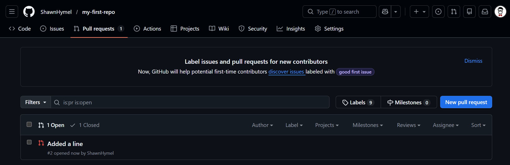

Click on the pull request to navigate into the PR page. Note that you are able to provide feedback here: treat it like a forum thread where you can tag people and have a discussion about the PR.

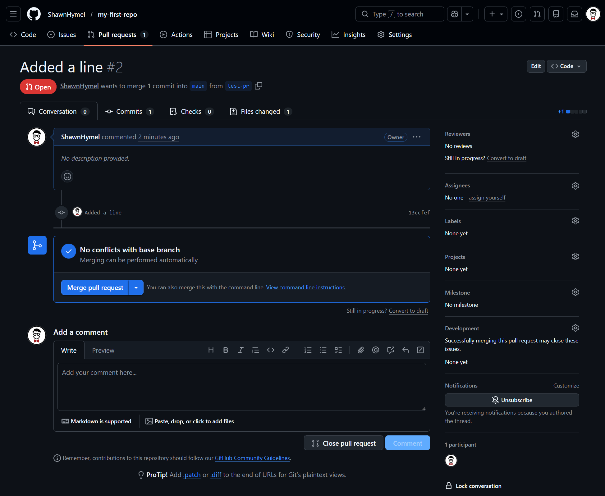

Person A should look through the changes (i.e. click on the **Files changed** tab). Note that at this point, you can verify the changes locally by [fetching](https://git-scm.com/docs/git-fetch) the most recent branch/tag changes and then checking out the PR's branch. You're also welcome to simply look at the changes on GitHub for this exercise.

If Student A finds anything wrong with the PR, they can write a comment describing what Student B should change. 

> **Note**: A Pull Request is often a process (instead of a one-time event). You might spend days negotiating exactly what needs to change for the PR to be accepted. If something can't be fixed or the changes are unacceptable, Student A can always just reject the PR.

Once Student A is happy with the submitted changes, they should click the **Merge pull request** button. Write a commit message (describing why you're accepting the PR).

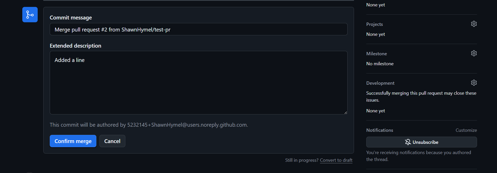

Click **Confirm merge**. This will take any commits made by Person B and add them to your *main* history, effectively merging their work with yours.

Person A can now go back to the main page of their repository and verify that the changes were made.

#### Step 5: Update Local Repositories

Now that the PR has been merged with the upstream repository, both Person A and Person B should update their local copies so that it reflects those changes.

**Student A**

As the upstream owner, you simply need to use the CLI or GUI tool to check out the *main* branch and perform a *pull* to download the latest changes from the remote server.

**Student B**

Your forked version might be out of date with the upstream version. Navigate to the GitHub page for your forked project and click the **Sync fork → Update branch** button. This will update the fork to match Student A's repository.

Then, update your local version by using the CLI or GUI tool to check out the *main* branch and perform a *pull* to download the latest changes from your forked repository.

## Going Further

Congratulations on finishing the workshop! Keep working with GitHub, and these concepts will get easier to grasp over time. Try to make it a point to use Git and GitHub every time you work on a project. In addition to backing up your work, you'll also amass a nice portfolio of projects that you can share with others.

If you want to dive deeper, here are some good resources to consider:

 * [Git cheat sheet](https://education.github.com/git-cheat-sheet-education.pdf)
 * [How to handle merge conflicts](https://www.cloudbees.com/blog/resolve-github-merge-conflicts)
 * [Git best practices](https://gist.github.com/luismts/495d982e8c5b1a0ced4a57cf3d93cf60)
 * [GitHub Actions](https://github.com/features/actions)

## License

This README document, all included images, and the slides are licensed under [Creative Commons Attribution 4.0 International (CC BY 4.0)](https://creativecommons.org/licenses/by/4.0/).